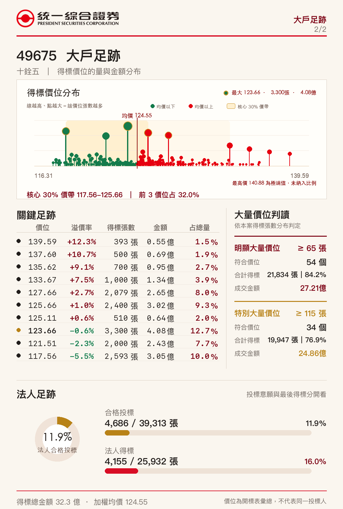
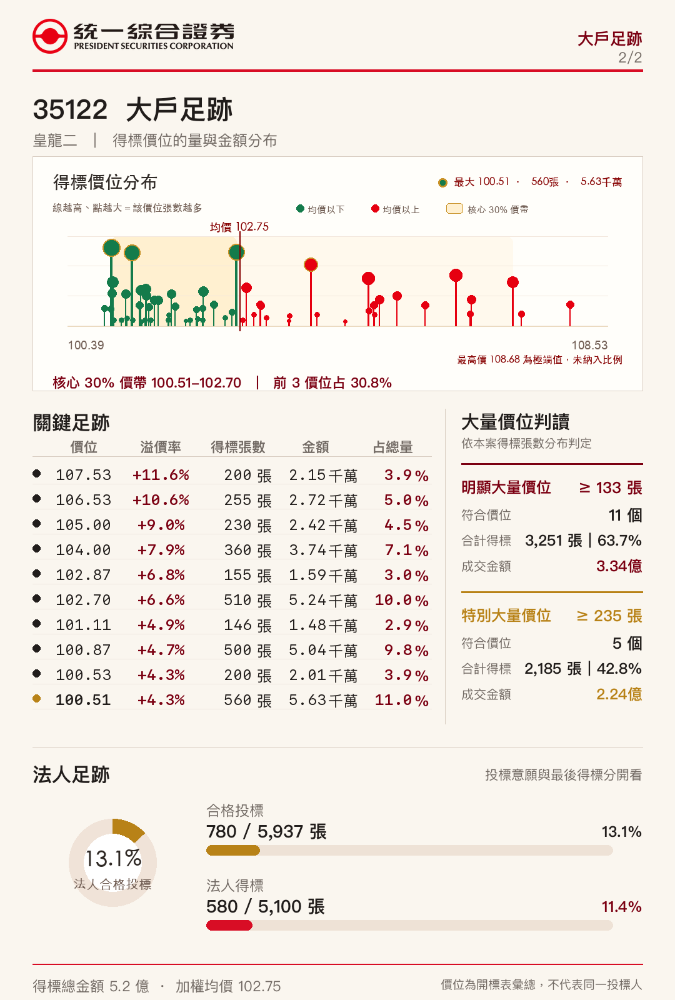

# 台灣 CB 競拍結果圖卡

台灣可轉換公司債競拍結果分享圖卡。價位、得標張數與成交金額取自 TWSA 開標統計表，通過張數及金額驗證後產出。

檔名格式：`YYYYMMDD_CB代號_p1.png`、`YYYYMMDD_CB代號_p2.png`。

## 2026-08-07

### 十銓五（49675）

[第一頁原圖](cards/2026-08-07/20260807_49675_p1.png) ｜ [第二頁原圖](cards/2026-08-07/20260807_49675_p2.png)

### 皇龍二（35122）

[第一頁原圖](cards/2026-08-07/20260807_35122_p1.png) ｜ [第二頁原圖](cards/2026-08-07/20260807_35122_p2.png)

資料僅供市場資訊分享，不構成投資建議。
