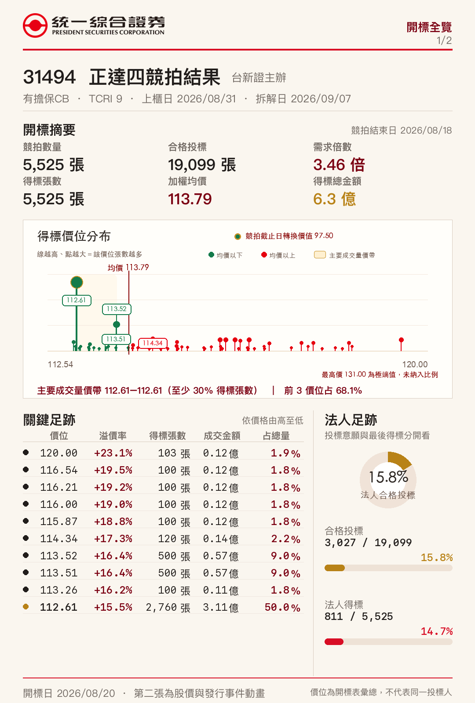
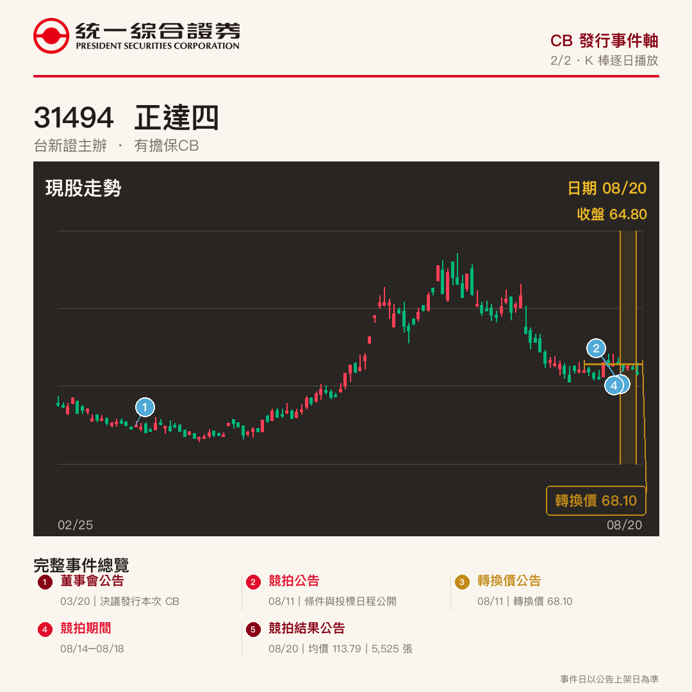
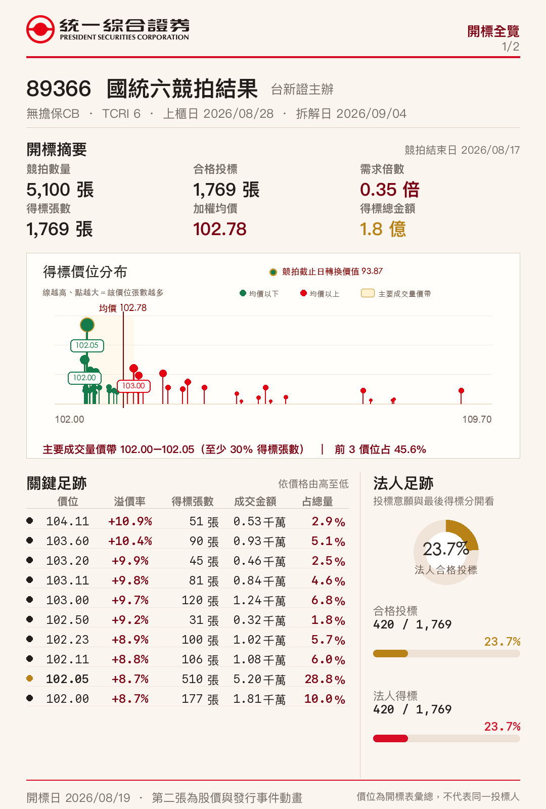
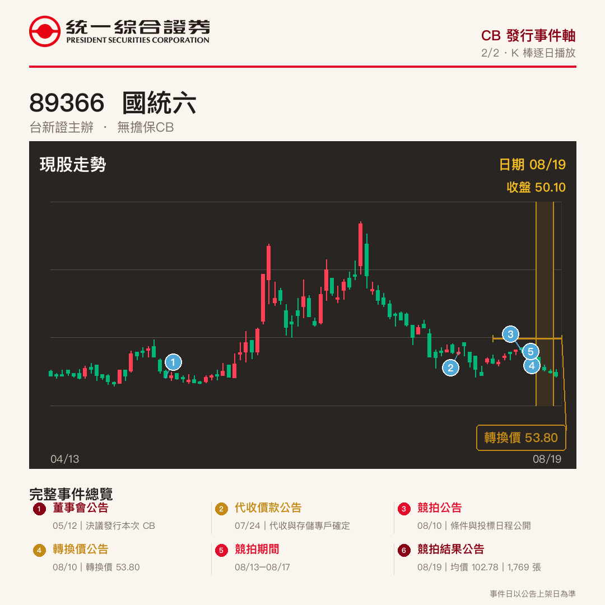
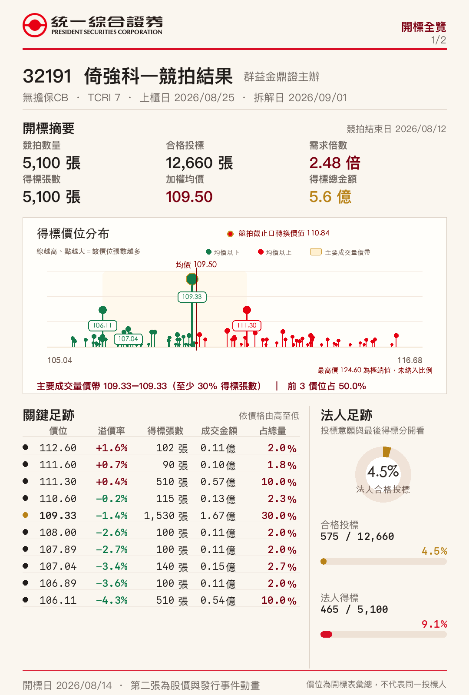
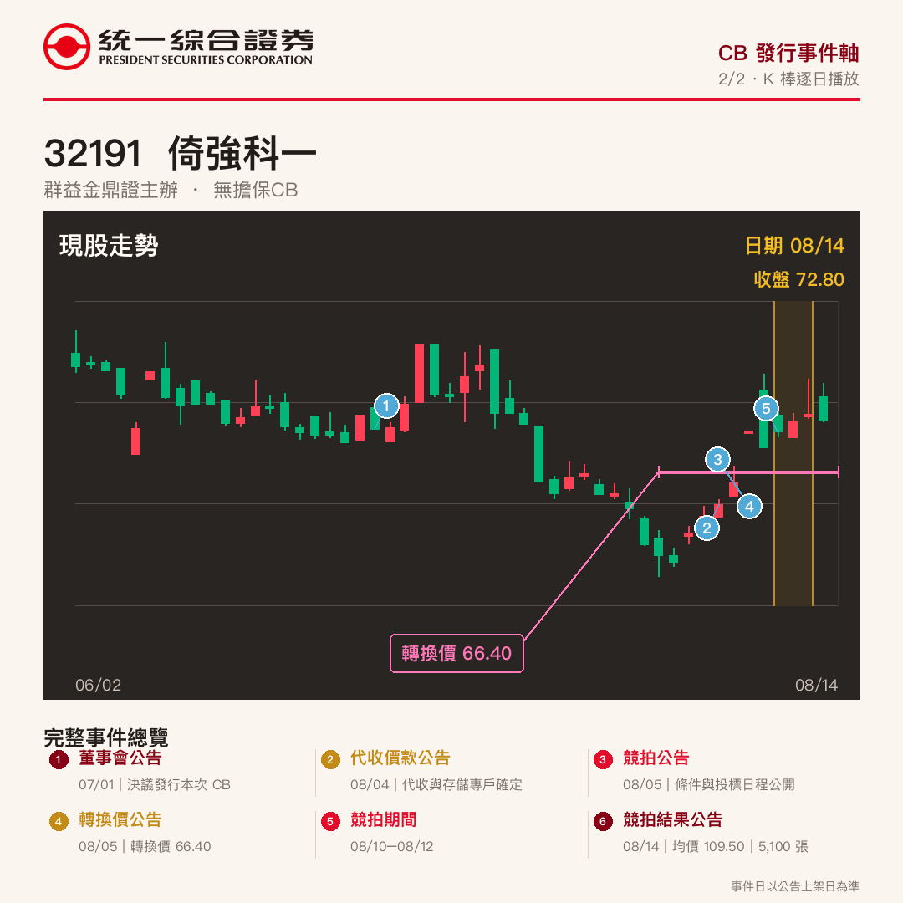
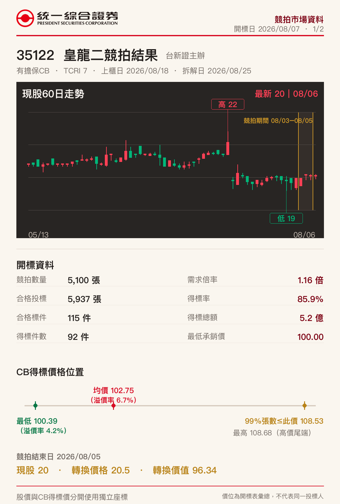
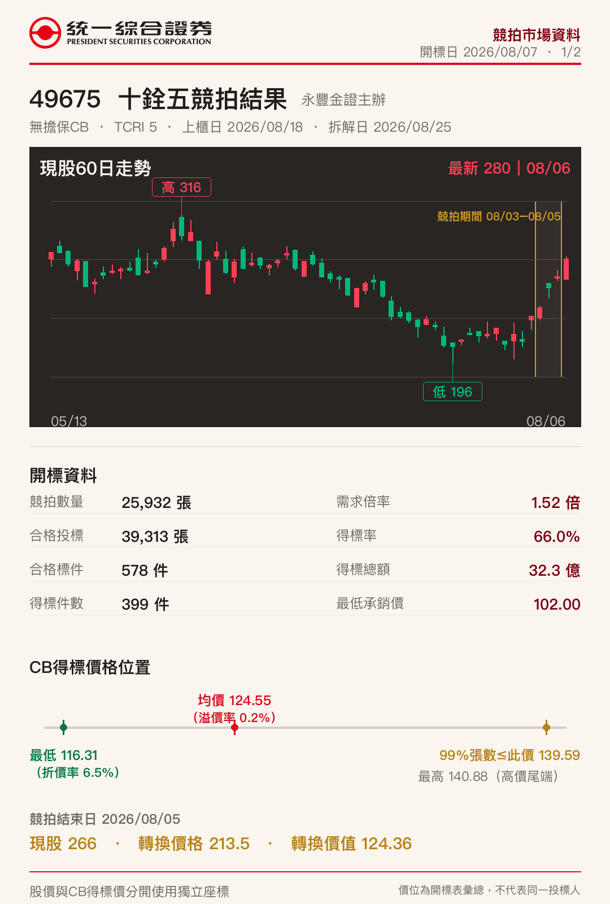
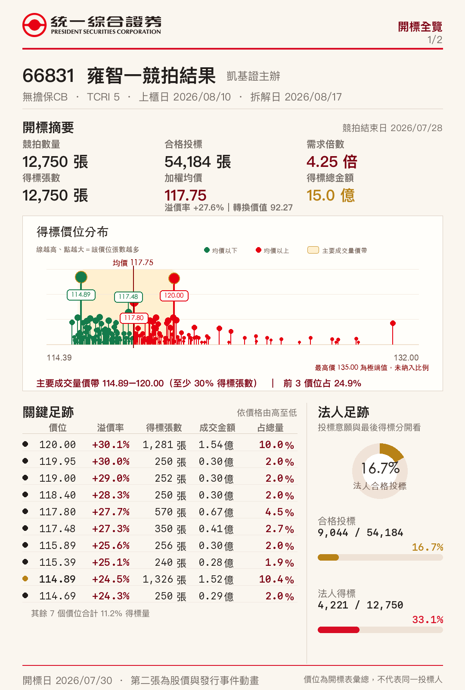
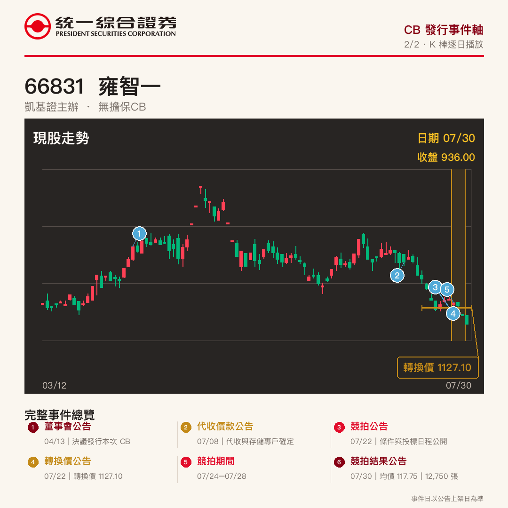

# 台灣 CB 競拍結果圖卡

台灣可轉換公司債競拍結果分享圖卡。數據取自 TWSA 開標統計表，通過張數與金額驗證後產出。

新版檔名格式：`YYYYMMDD_CB代號_p1.png`、`YYYYMMDD_CB代號_p2.mp4`。

## 2026-08-20

### 31494

[整合結果圖](cards/2026-08-20/20260820_31494_p1.png) ｜ [K 線事件動畫](cards/2026-08-20/20260820_31494_p2.mp4)

## 2026-08-19

### 89366

[整合結果圖](cards/2026-08-19/20260819_89366_p1.png) ｜ [K 線事件動畫](cards/2026-08-19/20260819_89366_p2.mp4)

## 2026-08-14

### 32191

[整合結果圖](cards/2026-08-14/20260814_32191_p1.png) ｜ [K 線事件動畫](cards/2026-08-14/20260814_32191_p2.mp4)

## 2026-08-07

### 35122

[整合結果圖](cards/2026-08-07/20260807_35122_p1.png) ｜ [第二頁原圖](cards/2026-08-07/20260807_35122_p2.png)

### 49675

[整合結果圖](cards/2026-08-07/20260807_49675_p1.png) ｜ [第二頁原圖](cards/2026-08-07/20260807_49675_p2.png)

## 2026-07-30

### 66831

[整合結果圖](cards/2026-07-30/20260730_66831_p1.png) ｜ [K 線事件動畫](cards/2026-07-30/20260730_66831_p2.mp4)

資料僅供市場資訊分享，不構成投資建議。
